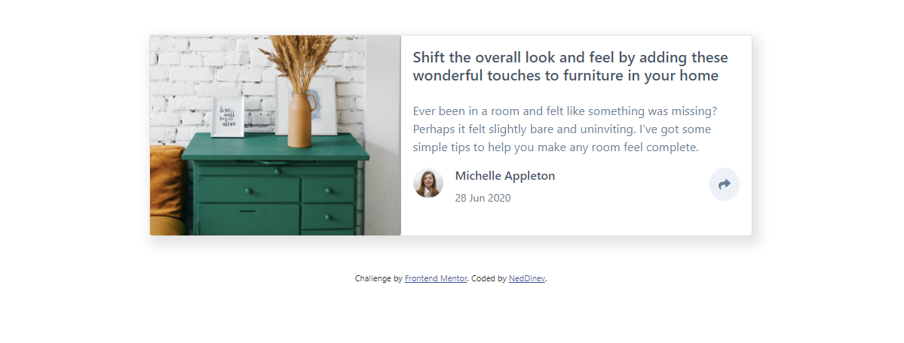

# Frontend Mentor - Article preview component solution

This is a solution to the [Article preview component challenge on Frontend Mentor](https://www.frontendmentor.io/challenges/article-preview-component-dYBN_pYFT). Frontend Mentor challenges help you improve your coding skills by building realistic projects. 

## Table of contents

- [Overview](#overview)
  - [The challenge](#the-challenge)
  - [Screenshot](#screenshot)
  - [Links](#links)
  - [Built with](#built-with)
- [Author](#author)


## Overview

### The challenge

Users should be able to:

- View the optimal layout for the component depending on their device's screen size
- See the social media share links when they click the share icon

### Screenshot




### Links

- Live Site URL: [Link](https://article-preview-component-master-neddinev.vercel.app/)


### Built with

- Semantic HTML5 markup
- SASS
- Bootstrap
- Javascript
- Desktop-first workflow

 


<h1>Some HTML code I'm proud of</h1>

```js
button.onclick = function () {
  if (social.style.display !== "none") {
    social.style.display = "none";
  } else {
    social.style.display = "unset";
  }
```


## Author

- Github - [NedDinev](https://www.github.com/neddinev
- Frontend Mentor - [@NedDinev](https://www.frontendmentor.io/profile/neddinev)
